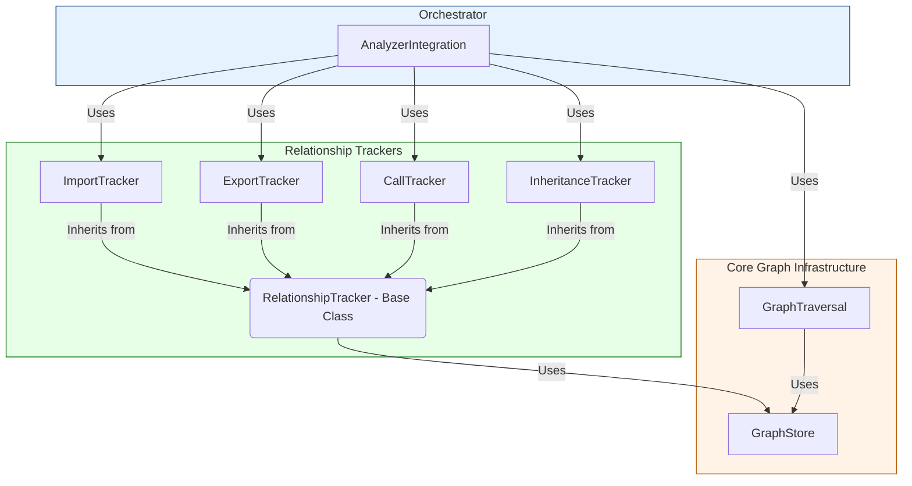

# MapCoDoc Graph Package

## Overview

The `graph` package provides a powerful and flexible system for building, storing, and analyzing a detailed relationship graph of a Python project's code elements. It allows for the tracking of relationships like imports, exports, function calls, and inheritance.

**Important Note:** This entire package is an **optional component** of the MapCoDoc pipeline. Its activation is controlled by the `GRAPH_ANALYSIS` feature flag.

*   When **disabled** (`GRAPH_ANALYSIS=0`, **default**), the pipeline runs in a lightweight, high-speed mode, resolving API paths without building this in-memory graph. This is the recommended mode for most use cases.
*   When **enabled** (`GRAPH_ANALYSIS=1`), this package is used to provide a robust, graph-based fallback for API path resolution and to enable advanced downstream analyses (e.g., cycle detection, impact analysis).

To enable graph analysis, use the CLI flag `--enable-graph-analysis` or set the environment variable `MAPCODOC_FEATURE_GRAPH_ANALYSIS=1`.

## Architecture

When `GRAPH_ANALYSIS` is enabled, the system follows a layered architecture. The `AnalyzerIntegration` component acts as the primary orchestrator, using specialized `Trackers` to populate a central `GraphStore`.



### **Explanation of the Diagram:**

*   **Orchestrator (`AnalyzerIntegration`):** This is the top-level component that drives the analysis. It is not part of the `graph` package itself but is the primary *consumer* of it.
*   **Relationship Trackers:** These are specialized classes within the `graph` package (`ImportTracker`, `ExportTracker`, etc.) responsible for understanding specific types of relationships. `AnalyzerIntegration` uses these trackers to add data to the graph. They all inherit common functionality from a `RelationshipTracker` base class.
*   **Core Graph Infrastructure:** This is the heart of the package.
    *   **`GraphStore`:** The low-level component that manages the actual NetworkX graph data structure. All trackers use the `GraphStore` to write their data.
    *   **`GraphTraversal`:** The component that contains the algorithms (like BFS, cycle detection, and our guided/exhaustive chain finding) that operate on the data in the `GraphStore`. `AnalyzerIntegration` uses this for its graph-based fallback path.

### Components

1.  **`GraphStore`**: The core data layer. It provides storage and basic graph operations using NetworkX, with performance optimizations for large codebases (e.g., indexing, caching).
2.  **`RelationshipTracker`**: A base class that provides common functionality for adding and querying relationships in the `GraphStore`.
3.  **Specialized Trackers (`ImportTracker`, `ExportTracker`, etc.)**: These classes inherit from `RelationshipTracker` and provide specialized methods for handling specific types of relationships (e.g., `add_import`, `find_exports_from_module`). They are used by `AnalyzerIntegration` to populate the graph.
4.  **`GraphTraversal`**: Provides algorithms for traversing the graph, such as finding all possible export chains for a component or detecting cycles. It is used by `AnalyzerIntegration` primarily for the fallback API resolution path.

## Performance Features

The `GraphStore` includes several performance optimizations when enabled:

-   **Indexing**: Maintains indices for fast lookups by edge type, source node, and target node.
-   **Caching**: Caches the results of expensive queries to avoid re-computation.
-   **Batch Operations**: Supports efficient batch insertion of nodes and edges via `begin_batch()` and `commit_batch()`.

## API Reference

The following examples assume that `GRAPH_ANALYSIS` is enabled and that you have an instance of `AnalyzerIntegration`, which internally holds the tracker instances.

### `GraphStore`

The `GraphStore` class provides the low-level interface to the NetworkX graph.

```python
# Typically accessed via an analyzer instance
analyzer = ...
graph_store = analyzer.store

# Add a node
graph_store.add_node("my_module.MyClass", node_type="class")

# Add a relationship edge
# The key is used to uniquely identify this edge in the MultiDiGraph
graph_store.add_edge(
    source="my_module.MyClass",
    target="base_package.BaseClass",
    key="INHERITS", # The NetworkX key
    edge_type="INHERITS", # The semantic type, stored as an attribute
    metadata={"is_direct": True}
)

# Querying
successors = graph_store.get_successors("my_module.MyClass", edge_type="INHERITS")
edges = list(graph_store.get_edges(source="my_module.MyClass", edge_type="INHERITS"))
```

### `ExportTracker`

Specializes in `EXPORTS` relationships.

```python
# Typically accessed via an analyzer instance
export_tracker = analyzer.export_tracker

# Add an export (e.g., from a resolved re-export)
# Note: The key is derived from the exported_name to ensure uniqueness.
export_tracker.add_export(
    exporting_module_fqn="my_app.api",
    target_component_fqn="my_app.utils.helper_func",
    exported_name="helper_func",
    is_reexport=True,
    is_explicit=True
)

# Find exports
# Find all things exported from a specific module
exports_from_api = export_tracker.find_exports_from_module("my_app.api")
```

### `ImportTracker`

Specializes in `IMPORTS` relationships.

```python
from code_analysis.graph.models import ImportRecord

# Typically accessed via an analyzer instance
import_tracker = analyzer.import_tracker

# Create an ImportRecord (as CodeVisitor does)
record = ImportRecord(
    importer_module_fqn="my_app.views",
    source_module_fqn="my_app.utils",
    raw_imported_name="helper_func",
    name_bound_in_importer="helper_func",
    name_bound_points_to_fqn="my_app.utils.helper_func"
    # ... other fields
)

# Add the import to the graph
import_tracker.add_import(record)

# Query for imports
# Find modules that import 'my_app.utils'
importers = import_tracker.get_importers_of_module("my_app.utils")
```

### `GraphTraversal`

Provides graph-based search algorithms, primarily for the API resolution fallback.

```python
# Typically accessed via an analyzer instance
traversal = analyzer.traversal

# --- Tier 2 Fallback: Guided Graph Trace ---
# (Assumes api_resolver has determined the best target module)
# chains = traversal.find_export_chains_guided_graph(
#     target_component_fqn="my_app.utils.helper_func",
#     end_module_fqn="my_app.api",
#     all_re_exporters={"my_app.api", "my_app.core"},
#     definition_module_fqn="my_app.utils"
# )

# --- Tier 3 Fallback: Exhaustive Search ---
all_possible_chains = traversal.find_export_chains(
    target_component_fqn="my_app.utils.helper_func"
)

# --- Other Advanced Analysis ---
# Find all import cycles in the project
import_cycles = traversal.find_cycles(edge_type="IMPORTS")
```
```