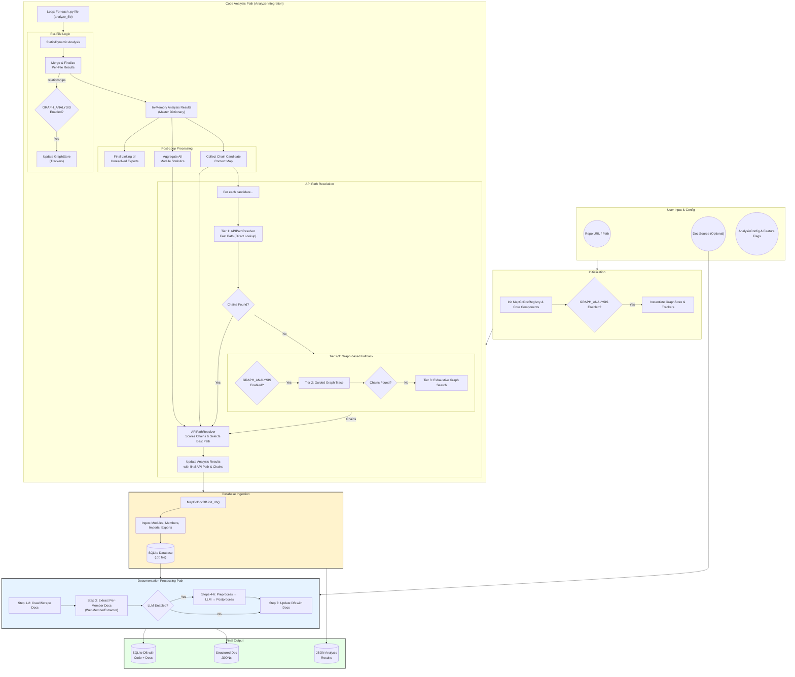

# MapCoDoc Pipeline Workflow

This document provides a high-level view of how MapCoDoc ingests source code and documentation, builds rich internal representations, and ultimately produces trace links between code components and their reference documentation. The pipeline is designed with a tiered analysis strategy to balance speed and accuracy.

---

## Overview

1.  **User Input & Configuration**
    *   Repository to analyze (local path or remote URL).
    *   `AnalysisConfig` and Feature Flags are loaded, determining the analysis strategy.
    *   The `MapCoDocRegistry` is initialized to manage and provide components.
    *   Optional: Documentation source (PDF path or URL) for trace-link recovery.

2.  **Code Analysis (Orchestrated by `AnalyzerIntegration`)**
    *   **Phase 1: Per-File Data Extraction Loop (`analyze_file`)**
        *   `AnalyzerIntegration` iterates through every Python file in the repository.
        *   For each file, it performs static analysis (`CodeVisitor`) to extract definitions, imports, exports, and raw module statistics. Re-exports that cannot be resolved statically are flagged.
        *   If needed (`Feature.DYNAMIC_ALL_EVALUATION`), it performs dynamic analysis (`DynamicAnalyzer`) to get a more accurate view of runtime exports.
        *   The static and dynamic results for the file are merged, and unlinked re-exports are resolved "on-the-fly" if their dependencies have already been analyzed.
        *   The final, comprehensive analysis result for the file is stored in memory.
        *   **If `Feature.GRAPH_ANALYSIS` is enabled**, the relationships (imports, exports, etc.) from the file are added to the in-memory `GraphStore`.

    *   **Phase 2: Post-Loop Final Linking & Context Aggregation**
        *   After all files are analyzed, a final pass is made to resolve any remaining unlinked re-exports using the complete set of analysis results.
        *   A `candidates_to_re_exporters` map is created, linking each re-exported component to all modules that re-export it.
        *   All `module_statistics` are aggregated.
        *   **Inherited Member Resolution**: `InheritanceResolver` resolves inherited methods for each class:
            *   Internal bases: Methods extracted from analysis results
            *   External bases: `ExternalIntrospector` dynamically discovers methods using isolated venv
            *   Exception fallback classes (try/except import patterns) are detected and handled correctly

    *   **Phase 3: Tiered API Path Resolution (Driven by `AnalyzerIntegration`)**
        *   For each "chain candidate" (re-exported component), the pipeline attempts to find its full export chain(s) using a tiered strategy:
        *   **Tier 1 (Fast Path):** `APIPathResolver` attempts to find the chain(s) by performing a "Guided Virtual Graph Trace." This is a fast, graph-less search that directly queries the collected `import_records` from the analysis results.
        *   **Tier 2 (Graph-based Fallback):** If Tier 1 fails **and** `Feature.GRAPH_ANALYSIS` is enabled, the system falls back to using the populated `GraphStore`. `GraphTraversal` performs a "Guided Graph Trace."
        *   **Tier 3 (Exhaustive Fallback):** If Tier 2 also fails, `GraphTraversal` can perform an exhaustive, one-way search of the entire import graph as a final safety net.
        *   **Scoring & Selection:** The chains found by the successful tier are passed to `APIPathResolver`, which scores them based on module statistics and heuristics to select the best public API path.

3.  **Database Ingestion**
    *   Analysis results are ingested into a SQLite database via `MapCoDocDB`.
    *   The database stores:
        *   **Modules**: All analyzed Python modules with metadata
        *   **Members**: Classes, functions, methods, variables with their API names, signatures, and source code
        *   **Imports**: Import relationships between modules
        *   **Exports**: Export relationships showing which members are re-exported and where
        *   **Inherited Members**: Inherited member relationships with derived API names
            *   Links inheriting class to inherited method
            *   Stores signatures for stop signal detection
            *   Marks external vs internal source
            *   External inherited members can store documentation directly

4.  **Documentation Processing (Orchestrated by `DocProcessingRunner`)**
    *   **Step 1: URL Crawling** (Web) or **PDF Localization** (PDF)
        *   Discovers all documentation pages under a base URL, or locates the PDF file.
    *   **Step 2: Scraping**
        *   Extracts raw text from HTML pages or PDF files.
        *   Organizes into `per_member/`, `per_module/`, or `per_page/` layouts.
    *   **Step 3: Member Extraction**
        *   Uses `WebMemberExtractor` with lexical + semantic search to extract individual API docs from combined pages.
        *   `StopSignalMatcher` detects boundaries between members.
        *   Missing method docs are extracted from parent class documentation.
    *   **Step 4: URL Preprocessing** (Optional, if LLM enabled)
        *   Replaces URLs with placeholders to prevent LLM hallucination.
    *   **Step 5: Structured Extraction** (Optional, if LLM enabled)
        *   `ConcurrentDocExtractor` uses GPT-4o to structure raw documentation into JSON schema.
    *   **Step 6: URL Postprocessing** (Optional, if LLM enabled)
        *   Restores URLs from placeholders in structured output.
    *   **Step 7: Database Update**
        *   Updates `DBMember` records with documentation fields.
        *   For internal inherited members: Updates original member with documentation
        *   For external inherited members: Stores documentation directly on `DBInheritedMember` record

5.  **Output & Persistence**
    *   SQLite database with all code and documentation data
    *   JSON analysis results with full export chains and API paths
    *   Per-member structured documentation JSONs

---

## Detailed Workflow Diagram



---

## CLI Commands

MapCoDoc provides a command-line interface with the following commands:

| Command | Description |
|---------|-------------|
| `analyze` | Analyze a Python repository, ingest to DB, optionally process docs |
| `extract-docs` | Standalone documentation extraction for an existing database |
| `save-features` | Save current feature flag states to JSON |
| `list-features` | Display all available feature flags and their current states |

### Example Usage

```bash
# Full analysis with documentation processing
python -m cli.main analyze ./path/to/repo \
    --doc-source "https://docs.example.com/api/" \
    --enable-dynamic-all \
    --enable-chain-candidates \
    --enable-api-boundaries \
    --enable-advanced-exports

# Standalone doc extraction
python -m cli.main extract-docs \
    --db-path mapcodoc_output/mylib_1.0.db \
    --library-name mylib \
    --version 1.0 \
    --doc-source "https://docs.example.com/api/"

# Skip LLM processing (no OPENAI_API_KEY)
python -m cli.main extract-docs \
    --db-path mapcodoc_output/mylib_1.0.db \
    --library-name mylib \
    --version 1.0 \
    --doc-source ./docs/mylib.pdf \
    --skip-llm
```

---

## Component Responsibilities

| Phase | Component(s) | Key Classes/Modules |
|-------|--------------|---------------------|
| Configuration & Setup | `AnalysisConfig`, `MapCoDocRegistry`, `feature_flags` | `config.py`, `mapcodocreg.py`, `feature_flags.py` |
| Per-File Static Analysis | `CodeVisitor` | `code_visitor.py` |
| Definition Storage | `DefinitionRegistry` | `definition_registry.py` |
| Graph Storage & Trackers | `GraphStore`, `ImportTracker`, `ExportTracker`, etc. | `graph/store.py`, `graph/importer.py`, etc. |
| Dynamic Export Analysis | `DynamicAnalyzer`, `VirtualEnvironment` | `dynamic_analyzer.py` |
| Orchestration & API Resolution | `AnalyzerIntegration`, `APIPathResolver` | `analyzer_integration.py`, `api_resolver.py` |
| Export Chain Finding | `GraphTraversal` | `graph/traversal.py` |
| **Database Management** | `MapCoDocDB`, `QueryManager` | `mapcodoc_db/db_manager.py`, `mapcodoc_db/query.py` |
| **URL Crawling & Scraping** | `url_crawler`, `doc_scraper` | `doc_processor/web_doc/` |
| **Member Extraction** | `WebMemberExtractor`, `StopSignalMatcher` | `doc_processor/filter_doc.py` |
| **PDF Extraction** | `MemberExtractor`, `PDFExtractor` | `doc_processor/file_doc/pipeline_pdf.py` |
| **Structured Doc Extraction** | `DocumentationExtractor`, `ConcurrentDocExtractor` | `doc_processor/structured_doc_extracter.py` |
| **Doc Processing Orchestration** | `DocProcessingRunner` | `doc_processor/doc_runner.py` |

---

## Feature Flag Interplay

*   **`CHAIN_CANDIDATE_COLLECTION`** (Default: `True`): Identifies re-exported components as "chain candidates" for API path resolution.

*   **`API_BOUNDARY_DETECTION`** (Default: `True`): Uses module statistics to score the "boundary likelihood" of modules, influencing chain ranking.

*   **`DYNAMIC_ALL_EVALUATION`** (Default: `False`): Executes module code to resolve dynamic `__all__` lists and discover runtime exports.

*   **`ADVANCED_EXPORT_HEURISTICS`** (Default: `True`): Enables additional scoring rules in `APIPathResolver` for chain selection.

*   **`GRAPH_ANALYSIS`** (Default: `False`): Enables the full in-memory graph for Tier 2/3 fallback resolution.

*   **`CALL_GRAPH_ANALYSIS`** (Default: `False`): Enables collection of function/method call relationships (requires `GRAPH_ANALYSIS`).

**Typical Usage for Best Results:**

Enable `CHAIN_CANDIDATE_COLLECTION`, `API_BOUNDARY_DETECTION`, and `ADVANCED_EXPORT_HEURISTICS` (all default to `True`). Enable `DYNAMIC_ALL_EVALUATION` for libraries with dynamic `__all__`. Enable `GRAPH_ANALYSIS` only if the fast path fails for complex re-export patterns.
